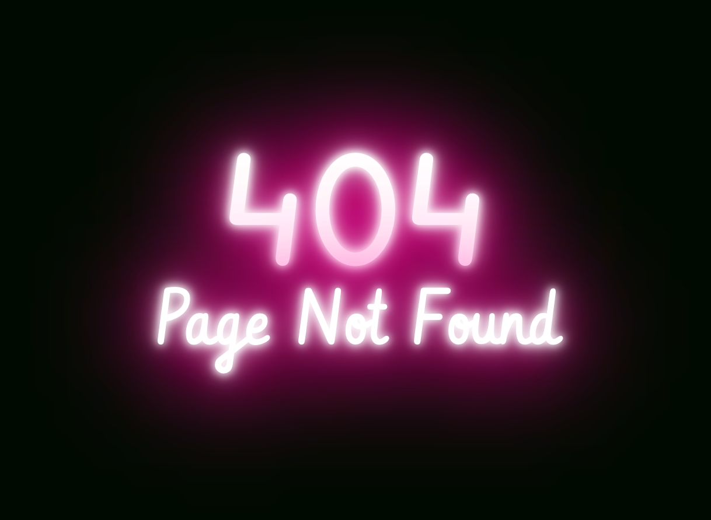

# 404 Page

A simple 404 page test with a little twist, it utilises glow to appear like a neon sign that after a couple of seconds breaks and starts flickering.

This was a little experiment to play around with the ideas from [here](https://css-tricks.com/how-to-create-neon-text-with-css/).

_Hint: a surprise starts if you stay on the page for a few seconds!_
